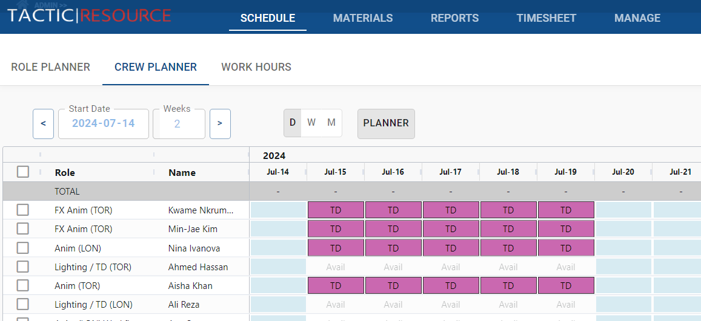
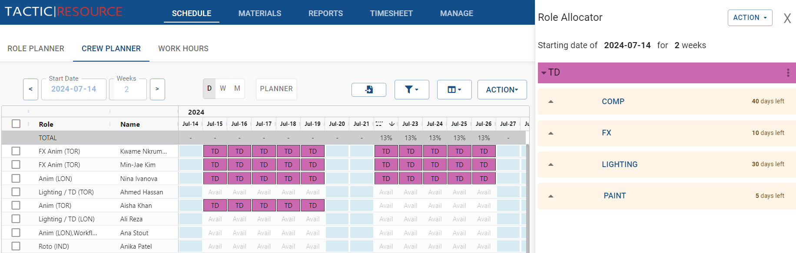
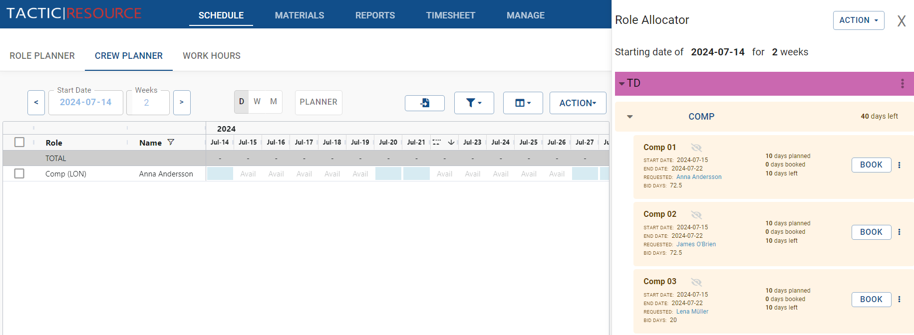
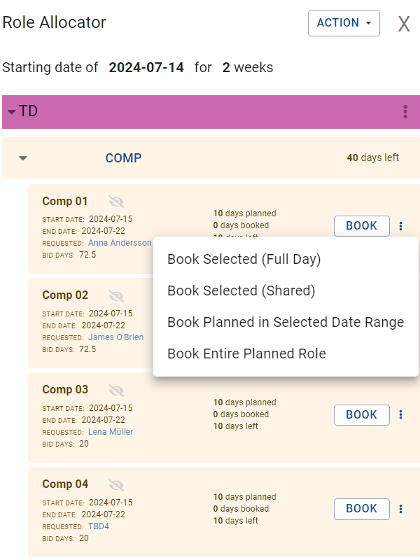

Crew Planner: Booking Roles into User Schedules
===============================================

The Crew Manager has a Planner which enables schedulers to allocate roles from various project plns into user schedules. This process involves selecting a user, choosing the desired roles from available projects, and booking the required timeframes for each role.
Steps to Book Roles into User Schedules

Open the Planner in the Crew Manager by clicking on the Planner button:

{: style="padding: 20px"}

This will open up an interface to the right.  The interface allows schedulers to browse through various departments and select available roles from multiple projects.

Select the project with the roles needed to allocate.

{: style="padding: 20px"}

Upon selecting a department, the Role Allocator will display all available roles associated with projects within that department.  If a specific crew member has been requested for a role, their name will appear as a clickable link next to the role.  Clicking on the crew member's name will initiate a search within the system, displaying the crew member's details, such as their schedule, professional infomation and contact information.

{: style="padding: 20px"}

Select the user for whom you want to book roles by using the "Select User" dropdown menu or searching for the user in the search bar.

Browse through the list of roles and identify the role(s) you wish to assign to the selected user.

{: style="padding: 20px; width: 50%; margin: 0px auto"}

Click on the desired role to view additional details, such as project information, duration, and requirements.

Specify the desired booking period by selecting the start and end dates, or choose "Weekly" to book the role for entire weeks.

Confirm the booking by clicking the "Book" button.

Managing Role Bookings

To view or edit existing role bookings, navigate to the "User Schedules" view within the Crew Manager.

Locate the user and their associated role bookings in the schedule.

Click on the role booking to view additional details or make changes, such as updating the booking period or reassigning the role to a different user.

Save any changes made to the role booking to ensure the schedule is updated accordingly.

By using the Crew Manager to book roles into user schedules, administrators can effectively allocate resources and ensure project requirements are met. This feature provides a comprehensive overview of resource allocation across multiple projects, enabling efficient project management and streamlined workflows.
