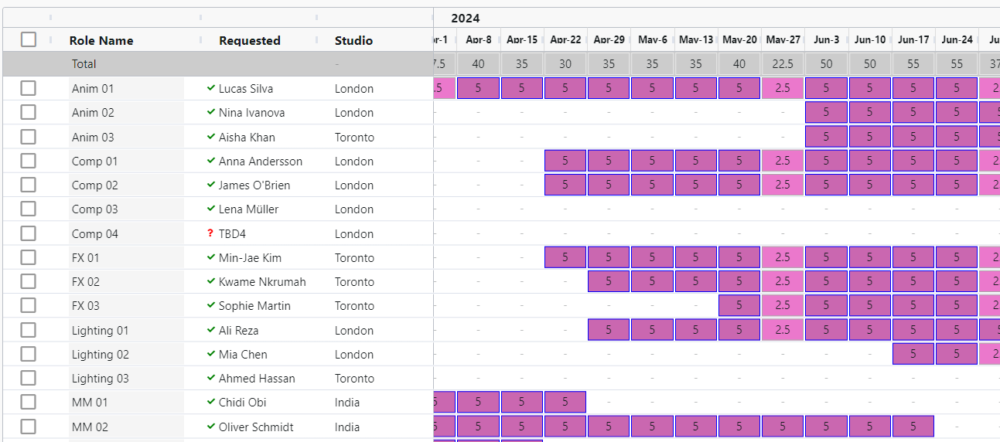
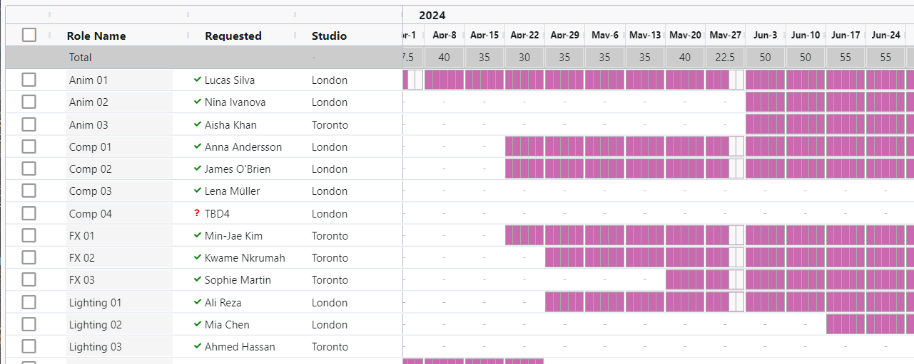
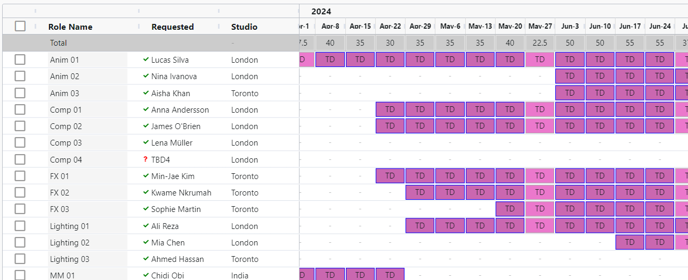
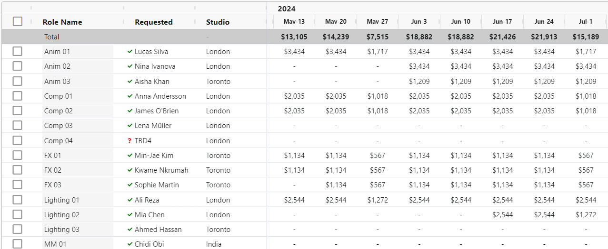

Display Modes: Customizing Visualization
=====================================================

The Role Planner offers multiple display modes to customize the visualization of cells, providing users with a flexible and detailed view of project allocations and resources.

**Schedule Mode**: Displays the number of days allocated for each week, along with color-coded cells that represent the associated label.

**Day Mode**: Shows the allocation by day, allowing users to specify the exact days (e.g., Monday, Wednesday, Friday) rather than just the total number of days.

**Label Mode**: Presents the label associated with each role or allocation, replacing the number of days with a descriptive label for quick identification.

**Cost Mode**: Reveals the cost per week for each allocation, enabling users to monitor and analyze financial implications directly within the Role Planner.

These display modes empower users to visualize the date in the Role Planner to their specific needs.

## Schedule Mode: Streamlining High-Level Planning

The Schedule Mode in the Role Planner is an effective display mode for high-level project planning, enabling users to create and manage production schedules efficiently.

{: style="padding: 20px"}

Its key features and benefits include:

**Quick Cell Selection**: Easily select multiple cells within the Role Planner to apply changes in bulk, reducing time spent on manual adjustments.

**Setting Days and Labels**: Simultaneously assign the number of days and corresponding labels for each selected cell, ensuring clarity and organization in the project timeline.

**Top Counts and Column Configuration**: Utilize count indicators at the top of the Role Planner and customize column settings to optimize schedule creation and management.

With these features, the Schedule Mode facilitates rapid and effective production schedule generation, providing a clear overview of project progress and resource allocation. Users can confidently manage their projects at a high level while maintaining essential granular control over crucial details, such as days allocated and role labels.

## Day Mode: Enabling Fine-Grained Schedule Control

The Day Mode in the Role Planner offers a more granular level of control when managing project schedules, enabling users to perform the same actions as the Schedule Mode while providing additional functionality for manipulating days within each week. Key features include:

{: style="padding: 20px"}

**Individual Day Management**: Break down each week into specific days, allowing for greater precision when assigning resources and managing the project timeline.

**Cycling Day Permutations**: Pressing the desired number of days for each week will cycle through various day combinations (e.g., Monday, Wednesday, Friday), providing flexibility and adaptability to meet project needs.

With the Day Mode, users can optimize their project schedules by tailoring resource allocation and task assignments to specific days within each week. This feature ensures that the project timeline remains accurate and well-organized, allowing for efficient management of resources and deadlines at a more detailed level.

## Label Mode: High-Level Overview of Project Breakdown

The Label Mode within the Role Planner provides a valuable high-level overview of the project's breakdown by displaying cells with their corresponding labels. This feature allows users to visualize the distribution of work across various aspects of the project, such as episodes or sequences. Key benefits include:

{: style="padding: 20px"}

**Work Distribution Visualization**: View the allocation of roles and resources across different project parts, enabling effective management of task assignments and workload balancing.

**Arbitrary Label Assignment**: Define custom labels for each cell to represent project components or milestones, facilitating organization and navigation within the Role Planner.

The Label Mode serves as a tool for assessing overall project structure and ensuring efficient resource allocation across various project stages or elements. Users can identify and manage the distribution of work, aiding in strategic decision-making and project execution.

For more information on labels, go [here]({{ 'labels' }})

## Cost Mode

{: style="padding: 20px"}

