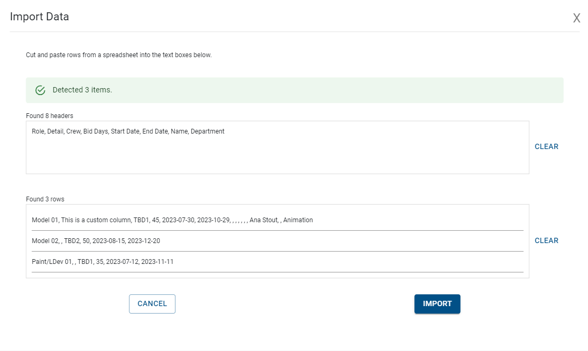

# Import Data into Role Planner

One of easiest ways to get data into the Role Planner is by copying and pasting from a spreadsheet.  This is convenient because spreadsheets are the most of starting point for a schedule.

{: style="padding: 20px"}

## Basic Imports

To import data, in the role planner, select the "Action -> Import Data".  This will open up a black import popup window.

There are a number of predefined columns that the import will use to import the data.

### Start dates and End date

The most basic schedule are simply the following columns

Role, Start Date, End Date

The importer will uses this data on import to create a schedule.

You can also use the following form instead of start and end date:

Role, Weeks

## Duplicate Role Names

The role names in a plan must all be unique within that plan.  Role names across scenarios will be related to each other.

Often, when importing from spreadsheets, the role names will not be unique.  Upon import, these role names will automatically be renamed to be unique.

