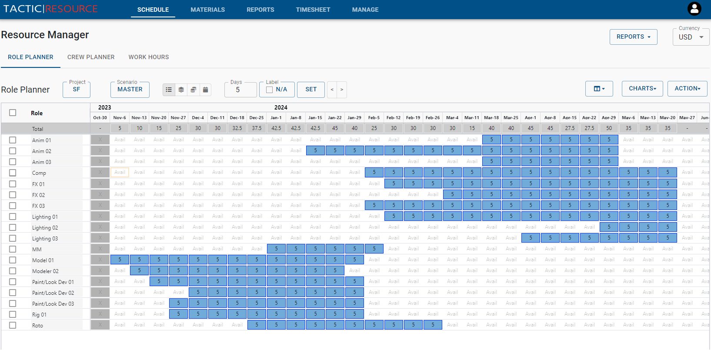

# Role Planner

The Role Planner is a powerful feature of Resource software tool, designed to simplify and streamline the allocation of resources within a project. By providing a comprehensive view of the project timeline, the Role Planner enables you to effectively manage roles and their respective schedules, ensuring optimal resource allocation and project efficiency.

The role manager allows you to create project planes using roles that you have defined in your organization.   A project plan consists of a list of roles that are require to complete a project.  Each role can lay out the number of days needed to work per week.

{: style="padding: 20px"}

The role planner is the central place for managing an individual project.  A producer can use the role planner to plan out the requires of a project, balancing out the project with both bid days and budget.  Also, as the project is crewed, the producer can use the role planner compare their plan with the actual booking of crew.

## Loading a project.

Before working on a plan, a project must be scheduled.  This is done under that "Action" menu and selecting Load Project.  Alternatively, if there is no project currently loaded, a project selector will be displayed in the center of the screen.

If the project that is loaded has no schedule yet, a window will appear where it is possible to add defined roles into the project.

## Creating a schedule

A project schedule can be created from the beginning.  When a project is first loaded, it will present

### Balancing the budget

### Balancing the bid days

## Importing a schedule

The easiest way to import roles is to copy and paste the from a spreadsheet.

## Custom columns

## Scenarios

The role planner allows for the creation of many scenarios.  There is usually a published scenario which is the official published scenario that is visiable to others.  It is also the default scenario that is loaded when loading the project.

Scenarios are other schedules within the same project.  They can be used in a variety of ways:

1. Create a new major revision of the schedule
2. Create multiple alternative scenarios of a project to determine which would be best

### Creating a scenario

### Publishing a scenario

Key Features and Functionality
Creating and Assigning Roles: Easily define and assign roles to your project. Roles represent the various functions or responsibilities required for project completion, enabling clear communication of expectations and tasks.

Custom Role Attributes: Customize role attributes to suit your project's unique needs. Specify role type, duration, and requirements, tailoring each role to its specific function within the project.

Role Allocation on Timeline: Allocate roles to specific periods on the project timeline. This visual representation allows you to see the distribution of roles across the entire project, making it easy to identify potential overlaps or gaps in resource allocation.
Drag-and-Drop Timeline Adjustments: Quickly adapt to changes in project requirements or resource availability with intuitive drag-and-drop functionality. Update role allocations on the timeline as needed, ensuring your project remains on track and resources are used effectively.
Progress Tracking: Monitor the progress of each role throughout the project. This feature provides valuable insights into resource utilization, helping you identify potential bottlenecks or areas where additional support may be required.
Benefits of Using the Role Planner
Improved Resource Allocation: The Role Planner enables you to optimize resource allocation, ensuring roles are filled effectively and efficiently. This results in reduced project costs, increased productivity, and better overall project performance.
Enhanced Collaboration: By clearly defining roles and responsibilities, the Role Planner facilitates communication and collaboration among team members, reducing misunderstandings and promoting a more cohesive work environment.
Streamlined Project Management: With a comprehensive view of the project timeline and role allocations, you can make informed decisions to keep your project on track, address potential issues proactively, and ensure successful project completion.
In conclusion, the Role Planner is a powerful tool for efficient resource allocation and project management. By leveraging its features and functionality, you can optimize the use of your resources, maintain project timelines, and drive project success.

