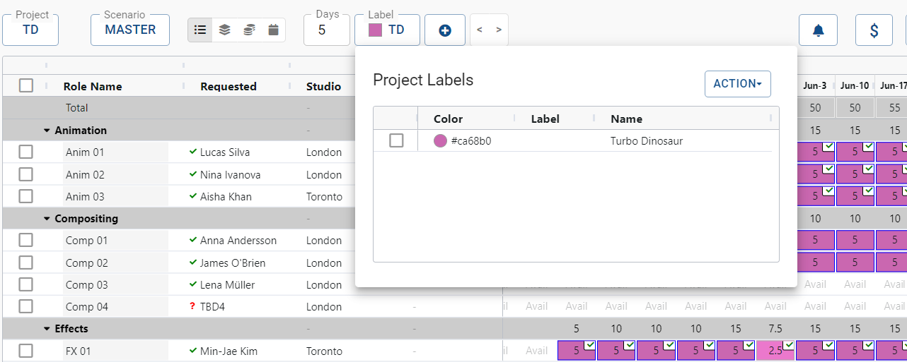
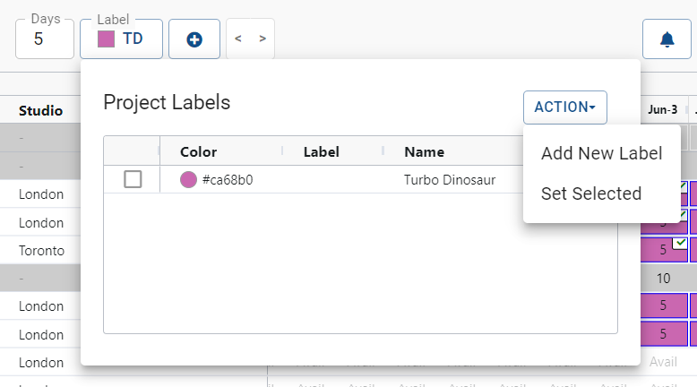
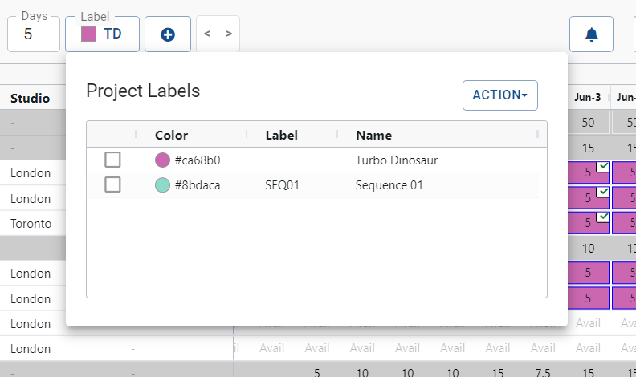

Managing Labels
===============

The Role Planner within the Resource Manager application allows schedulers to create and assign labels for each week within a role's timeline. These labels can help categorize project sub-sections, such as sequences or milestones, to provide better organization and visibility for project planning. Labels are customizable and can represent any desired categorization.

By effectively managing labels within the Role Planner, schedulers can categorize project sub-sections and improve project organization. This feature allows teams to visualize and track progress within specific segments of a project, facilitating efficient resource allocation and informed decision-making throughout the project lifecycle.

## Opening the Label Manager
Within the Role Planner, you can easily access the Label Manager to view, edit, or delete existing labels. To open the Label Manager, follow these steps:

Locate the "Label" button, typically found in the toolbar of the Role Planner interface.

Click on the "Label" button to open the Label Manager.

{: style="padding: 20px"}

The Label Manager will display a list of all existing labels used within the project, along with their corresponding colors and initials.

By accessing the Label Manager through the "Label" button, schedulers can manage larger projects within the Role Planner to categorize project sub-sections (such as episodes or sequences, for example) and streamline project organization.

## Setting Labels

Access the Role Planner and navigate to the desired role and week you wish to label.

Click on the "Labels" button to open the label management panel.

To create a new label, click on the "Add Label" button and enter the label name.
Customize the label's appearance by choosing a color from the color picker.

{: style="padding: 20px; width: 80%"}

Click "Save" to create the new label.

Edit the color, initials and name accordingly.

{: style="padding: 20px; width: 80%"}

## Applying Labels to Roles and Weeks

Select the cells on the Role Planner corresponding to the desired roles and weeks you want to label.

*Need image*

Open the label management panel and locate the appropriate label.  Click on the label to apply it to the selected cells.

*Need image*

Alternatively, you can press "L" on your keyboard to quickly set the current label to the selected cells.

## Editing and Removing Labels

Within the label management panel, locate the label you wish to modify or remove.

Click on the label's color to change its appearance or click on the label's name to edit its text.

*Need image*

