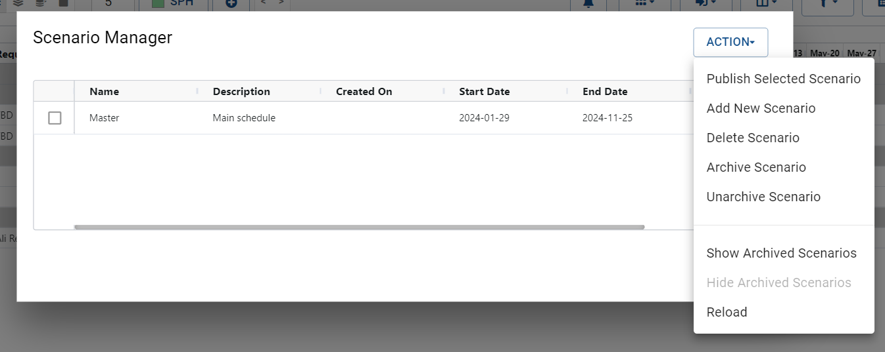
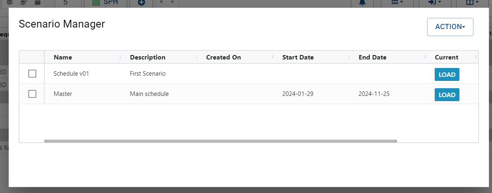

Managing Scenarios in the Role Planner
========================================

The Role Planner within the Resource Manager application allows schedulers to create and manage multiple scenarios for a project. A published scenario is considered the official version and is visible to others, while unpublished scenarios serve various planning and assessment purposes.

Each scenario provides a clean slate for project planning, enabling users to experiment with different resource allocations and schedule configurations while preserving the original project data. This flexibility supports iterative project management and data-driven decision-making.

## Uses of Scenarios
Scenarios can be utilized in different ways to enhance project planning and decision-making, such as:

Major Revision Planning: Create a new scenario to develop and refine a revised project schedule before publishing it as the official plan.

Alternative Scenario Analysis: Develop multiple scenarios with different resource allocations or timelines to compare and determine the most optimal approach for the project.

## Creating a Scenario

Access the Role Planner within the Resource Manager application.
Open the project for which you want to create a new scenario.
Locate and click on the "Scenarios" button, typically found in the toolbar or context menu of the Role Planner interface.

{: style="padding: 20px"}

Click on the "Add New Scenario" button and enter a name for the scenario.  A new scenario is automatically added to the table.

{: style="padding: 20px"}

Edit the name, description, start and end dates of this particular scenario by double clicking on the cell and editing it inline.

A scenario can be loaded by clicking on the "Load" button.  A new scenario will be empty and be complete indepenenty of other scenarios within a project.  From here a new project can be scheduled as described [here]({{ 'create' }})

If you wish to modify or build upon an existing schedule, you can copy the roles and schedule from another scenario into the new one. This functionality facilitates the adaptation of previous plans to suit evolving project requirements.

## Publishing a Scenario

Within the Role Planner, open the project containing the scenario you want to publish.
Access the "Scenarios" menu and locate the scenario you wish to publish.
Click on the "Publish" button associated with the selected scenario.
Confirm your choice to publish the scenario, making it the official version visible to others.

## Deleting and Archiving Scenarios

In addition to creating and publishing scenarios, the Role Planner within the Resource Manager application allows administrators to archive and delete scenarios as needed.
Archiving a Scenario

Within the Role Planner, open the project containing the scenario you want to archive.
Access the "Scenarios" menu and locate the scenario you wish to archive.
Click on the "Archive" button associated with the selected scenario.
Confirm your choice to archive the scenario, preserving it for future reference or potential reactivation.

## Deleting a Scenario
Within the Role Planner, open the project containing the scenario you want to delete.
Access the "Scenarios" menu and locate the scenario you wish to delete.
Click on the "Delete" button associated with the selected scenario.
Confirm your choice to delete the scenario permanently from the project.

By archiving and deleting scenarios in the Role Planner, administrators can maintain an organized and up-to-date project schedule, preserving valuable scenario data or removing irrelevant information as necessary.

By creating and managing scenarios within the Role Planner, schedulers can optimize project planning and decision-making by exploring alternative approaches and refining schedules before official publication.

